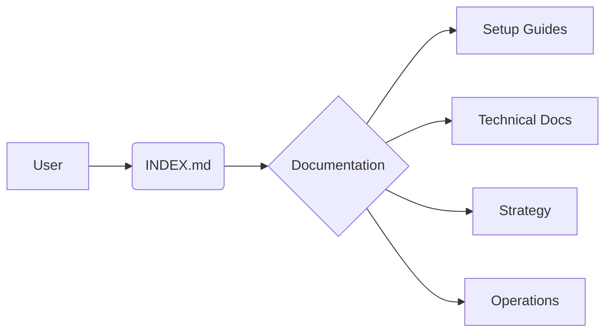

# BREEZER Documentation Hub

## Project Overview

- [📋 Project Summary](PROJECT_SUMMARY.md)
- [📊 Competitive Analysis](COMPETITIVE_ANALYSIS.md)
- [📈 Distribution Strategy](DISTRIBUTION.md)

## Technical Documentation

### Setup & Installation
- [⚙️ Setup Guide](SETUP.md)
- [🐋 LLAMAFILE Setup](LLAMAFILE_SETUP.md)
- [🐙 GitHub Setup](GITHUB_SETUP_PUBLIC.md)

### Build & Deployment
- [🏗️ After Build Process](AFTER_BUILD.md)
- [🔏 Signing Certificate Process](BREEZER_SIGNING_CERTIFICATE_PROCESS.md)

### Architecture
- [🤖 Agent System](AGENT_SYSTEM.md)
- [💬 Chat Implementation Strategy](BREEZER_CHAT_IMPLEMENTATION_STRATEGY.md)
- [👥 Consumer Strategy](BREEZER_CONSUMER_STRATEGY.md)

### Core Systems
- [🔧 Plan A Implementation](PLAN_A_IMPLEMENTATION.md)
- [🛠️ Plan B Preload Wrapper](PLAN_B_PRELOAD_WRAPPER.md)
- [🧠 Project Memory](PROJECT_MEMORY.md)

## Operations
- [📝 Changelog](CHANGELOG.md)
- [📖 Main README](../README.md)

---

graph LR
    A[User] --> B(INDEX.md)
    B --> C{Documentation}
    C --> D[Setup Guides]
    C --> E[Technical Docs]
    C --> F[Strategy]
    C --> G[Operations]